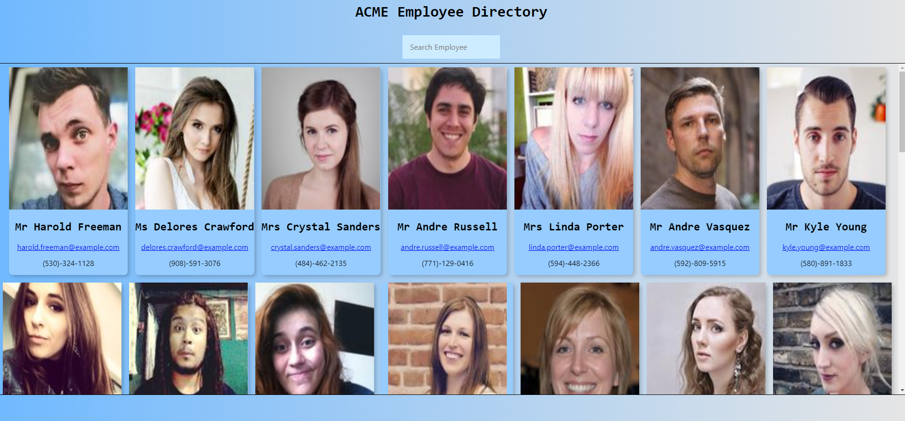

# Employee-Directory

 
 
This application is covered by the Mozilla license.

## Table of Contents
- [Description](#Description)
- [Installation](#Installation)
- [Usage](#Usage)
- [Lincense](#Lincense)
- [Contributing](#Contributing)
- [Tests](#Tests)
- [Questions](#Questions)

## Description  :clipboard:
* This is a budget tracker that users can use on the go, whether with internet access or not. All additions to the tracker while offline will populate when users come back online

### User Story

* As a user, I want to be able to view my entire employee directory at once so that I have quick access to their information.

### Business Context

* An employee or manager would benefit greatly from being able to view non-sensitive data about other employees. It would be particularly helpful to be able to filter employees by name.

 
Created with ReactJS, Tachyons and love :heart:.

## Installation :floppy_disk:
There is no installation for this project

## Usage :warning:
Go to the following site to view/play with the deployed version of this app:
 

## License :scroll:

 
This application is uses the Mozilla license. 

## Contributors :family:
Peter Izzo

Feel free to submit a pull request with any updates you would like to submit :)

## Tests 🧪
No tests for this project

### Screenshot of Running App

## Questions :question:
### For any issues please reach out to Peter Izzo
 
Feel free to reach out to me at  with any questions :wave: 
 
Check out the rest of my Github: https://github.com/peter-izzo :octocat: 
 

_This README was generated by [README-GEN](https://github.com/peter-izzo/README-GEN) :godmode:_